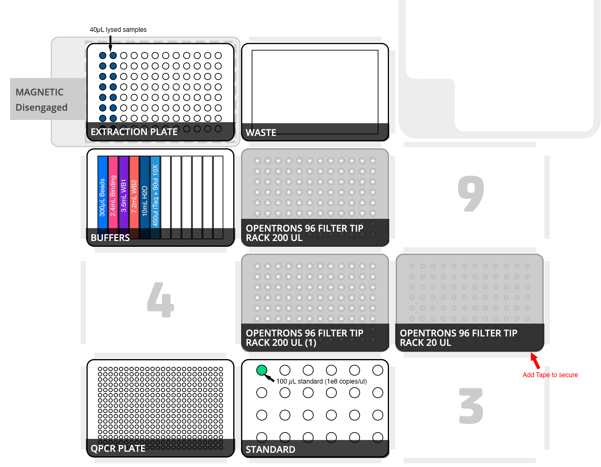

# Gnotobiotics: Germ-free status testing by 16S rRNA qPCR

## Theory
Checking the germ-free status of animals or quantifying the bacterial numbers in a sample can be carried out in a very sensitive and quantative manor using qPCR. This protocol is using primers targetting the V6 as it (and the V3) have properties that make it intrinsically better for qPCR than V4. The use of multiple DNA extraction and/or environmental controls will help establish the baseline level of background reagent contamination and allow empirical decisions on contamination status and/or bacterial quantity. 

This protocol is for semi-automated testing of germ-free status by qPCR. Note: this assay only detects bacterial colonization and should be supplemented with culture-based methods which may be more sensitive for easily grown organisms. These primers are also biased against certain organisms including *Akkermansia muciniphila*; however, they are still likely be to detected in a non-quantitative way. 

The extraction volumes for post-lysis extraction have been scaled down 5x to speed the extraction and save on reagents which have been hard to acquire as of late. Total extraction time and qPCR set up is approximately 33 minutes. Note, this protocol is hard-coded to extract 16 samples at a time but could easily be modified for more or less. A positive control and negative control (ex SPF mouse or human sample) should be included in every run.

## Materials
- [ ] ZymoBIOMICS 96 MagBead DNA Kit (Zymo D4302 OR D4308)
- [ ] Bio-Rad 96 Well Plate 200 µL skirted PCR plate  (Biorad hsp9601) 
- [ ] Biospec Mini-Beadbeater-96 or similar
- [ ] Beta Mercaptoethanol (BioRad 1610710) 
- [ ] Opentrons OT-2 with gen 2 Magnetic module, 20ul multichannel, and 300ul multichannel.
- [ ] 1 x Agilent 1 well 290 mL reservoirs (Agilent 201252-100)
- [ ] 1 x NEST 12 well reservoir (https://shop.opentrons.com/products/nest-12-well-reservoir-15-ml) 
- [ ] 2 x Opentrons filter 200ul tips (https://shop.opentrons.com/collections/opentrons-tips/products/opentrons-200ul-filter-tips)
- [ ] 1 x Opentrons filter 200ul tips (https://shop.opentrons.com/collections/opentrons-tips/products/opentrons-20ul-filter-tips)
- [ ] iTaq™ Universal Probes Supermix (BioRad 1725132)
- [ ] CFX384 thermocycler (Biorad)
- [ ] 384 Plates for qPCR (Biorad #HSP3865)
- [ ] Optically clear Plate Seals (Biorad Microseal ‘B’ #MSB1001)
- [ ] 10x Assay mix (prepare 2µM of each oligo below in nuclease-free water)
- [ ] A known standard of either a full-length 16S amplicon derived from a non-GI source (ex. Vibrio casei) or genomic DNA.

#### Oligos
|Oligo|Sequence|Stock [µM]|Working [µM]|Final [nM]|
|-|-|-|-|-|
|891F|TGGAGCATGTGGTTTAATTCGA|100|2|200|
|1003R|TGCGGGACTTAACCCAACA|100|2|200|
|1002P|	 	[6FAM]CACGAGCTGACGACARCCATGCA[BHQ1]|100|2|200|

## Protocol
*Location: Biological safety cabinet acceptable for BSL2 work should be used.
- [ ] Treat extraction area with UV ~15 minutes or 0.5% bleach.
- [ ] Add 750 µL beta-mercaptoethanol to 150mL bottle of MagBinding Buffer  *(0.5% (v/v) i.e., 500 µl per 100 ml)*
- [ ] Transfer ~50 mg or half fecal pellet, or 200µL liquid sample into lysing tube (included with kit, or MPbio lysing matrix E).
- [ ] Add 750 µL lysis buffer to tube.
- [ ] Disrupt for 5 minutes in Biospec beadbeater.
- [ ] Centrifuge w minutes at ~10,000g.
- [ ] Transfer 40 µL supernatant to columns 1 and 2 of a 200ul biorad PCR plate (BindingPlate).
- [ ] Step up OT-2 according to **Figure 1**.
- [ ] Download GnotoTesting.py and load into opentrons app.
- [ ] Calibrate all deck positions.
- [ ] **Add a strip of tape or two to secure the bottom right corner of the 20ul tips!!!**
- [ ] Run protocol.
- [ ] Cover plate with optically clear plate seal
- [ ] Centrifuge 30 seconds to remove air bubbles.
- [ ] Load plate in CFX384 according to the cycle parameters below:

### Cycling Parameters

Cycle |	Temperature (˚C)  | Time
------|-------------------|------
Initial Denaturation   |	95	| 5min
||
40 cycles:
Denature | 95˚C | 5 sec
Anneal/Extend | 60˚C	| 15 sec
||
Hold	| 4˚C	Hold | 0 sec

## Expected Results:
Because there are no such thing as DNA-free reagents, a background will be observed around cycle 33 of qPCR (see Figure 2). A germ-free animal should not amplify before negative controls as may be observed in a positive .

## Figures

 **Figure 1.** OT-2 deck layout. Deck positions are sequentially numbered 1-11 from the bottom left to the top right. **Position 1:** a 384 qPCR plate which is empty. **Position 2:** 100ul of a 16S standard in a 1.5 mL centrifuge tube in position A1 of the opentrons tube rack. **Position 5 and 8:** 200ul opentrons filter tips. **Position 6:** 20ul opentrons filter tips. **Position 7:** a NEST 12-well reservoir containing the following: Column 1 - 300ul mag beads, Column 2 - 2.4 mL binding buffer, Column 3 - 3.6 mL wash buffer 1, Column 4 - 7.2 mL wash buffer 2, Column 5 - 10 mL nuclease free water, Column 6 - 450 iTaq supermix for probes and 90ul 10X primer/probe mix. **Position 10:** Biorad 96-well PCR plate positioned on magnetic capture stand. **Position 11:** a waste container (Agilent 1 well 290 mL reservoir or upside down tip lid).

  To fill in....
